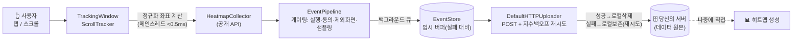
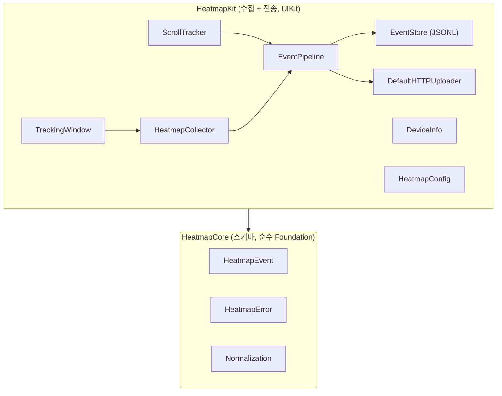

# HeatmapKit

[](https://github.com/DevVenusK/iOS-Hitmap/actions/workflows/ci.yml)


호스트 iOS 앱의 **탭·스크롤 이벤트를 디바이스 무관한 정규화 좌표로 수집해 서버로 직접 전송**하는
1st-party UX 분석 SDK. **히트맵 렌더링은 하지 않는다** — 수집된 데이터로 **당신이 나중에 직접** 히트맵을 만든다.

---

## 🎯 목적 (왜 만들었나)

> "유저가 화면의 어디를 많이 누르는가 / 얼마나 깊이 스크롤하는가"를 알고 싶다.

상용 분석 SDK(UXCam, Smartlook 등)는 편하지만 금융 앱에는 두 가지 문제가 있다:
1. **데이터 주권** — 사용자 상호작용 원본이 외부 벤더로 나간다.
2. **프라이버시 통제** — 무엇을 수집하는지 세밀하게 막기 어렵다.

HeatmapKit은 **수집 레이어만** 직접 소유한다. 좌표·화면이름·시간이라는 최소 데이터만 모아
**당신의 서버**로 보내고, 히트맵 시각화는 그 데이터로 원하는 도구에서 자유롭게 만든다.

**설계 원칙**
- **수집만 한다** — 렌더링/뷰어는 범위 밖 (Non-Goal)
- **좌표만** — 텍스트/입력값/요소식별자(elementID) 절대 미수집 → PII 경로 원천 차단
- **동의 기본 OFF** — 명시적 동의 전에는 단 한 건도 수집 안 함 (fail-safe, 회귀테스트로 강제)
- **서드파티 0 의존성** — 호스트 앱과 버전 충돌 없음
- **성능 예산** — 터치당 메인스레드 < 0.5ms (측정치 per-op ~0.15µs)
- **디바이스 무관** — SE와 Pro Max 데이터를 섞어도 의미가 유지되도록 0~1 정규화 + 화면크기 동봉

---

## 🧩 구성도

### 데이터 흐름



### 모듈 의존성



- **HeatmapCore** — UIKit 무의존 순수 로직(스키마·에러·좌표 정규화). 어디서든 단위테스트 가능.
- **HeatmapKit** — UIKit 글루 + 수집/저장/전송. 공개 API는 `HeatmapCollector` 하나로 좁힘.
- 테스트 가능성을 위해 게이팅/저장/전송 로직을 `EventPipeline`(생성자 주입)으로 분리, 싱글톤은 얇은 파사드.

---

## 📁 디렉토리 구조

```
Hitmap_Project/
├── Package.swift                 # SwiftPM: HeatmapCore + HeatmapKit 2 타겟
├── Sources/
│   ├── HeatmapCore/              # 스키마 · 에러 · 정규화(순수)
│   │   ├── HeatmapEvent.swift
│   │   ├── HeatmapError.swift    #   struct + code (확장에 안전)
│   │   └── Normalization.swift   #   좌표/스크롤깊이 순수 함수
│   └── HeatmapKit/               # 수집 + 전송(UIKit)
│       ├── HeatmapCollector.swift #  공개 진입점
│       ├── HeatmapConfig.swift
│       ├── HeatmapUploader.swift  #  프로토콜 + 내장 HTTP 전송기
│       ├── EventPipeline.swift    #  게이팅/저장/전송 코어(테스트 가능)
│       ├── EventStore.swift       #  JSONL 배치 저장
│       ├── TrackingWindow.swift   #  전역 탭 인터셉트
│       ├── ScrollTracker.swift    #  스크롤 깊이 샘플링(비스위즐)
│       └── DeviceInfo.swift
├── Tests/                        # 30 tests (XCTest)
├── docs/
│   ├── sdk-spec/                 # 기술 스펙 (v1 수집 스펙이 권위)
│   └── po/                       # PO 백로그(RICE) + 팀 의뢰 회신
└── .github/workflows/ci.yml      # SwiftPM test + iOS 시뮬 빌드
```

---

## 📦 수집되는 데이터 (서버로 가는 이벤트)

탭·스크롤을 하나의 flat 스키마로 통일. `screenW/H`+`device`+`orientation`을 함께 실어
어떤 기기든 합쳐 히트맵을 그릴 수 있다.

```json
// 탭
{ "schemaVersion": 1, "id": "9F2A…", "type": "tap", "screen": "loan_detail",
  "x": 0.42, "y": 0.73, "screenW": 390, "screenH": 844,
  "device": "iPhone15,3", "orientation": "portrait", "ts": 1719800000000 }

// 스크롤
{ "schemaVersion": 1, "id": "1C7B…", "type": "scroll", "screen": "loan_detail",
  "scrollDepth": 0.65, "scrollOffsetY": 1240,
  "screenW": 390, "screenH": 844,
  "device": "iPhone15,3", "orientation": "portrait", "ts": 1719800000000 }
```

| 필드 | 의미 |
|---|---|
| `id` | 이벤트 UUID — ACK 유실/재시도 시 **서버 측 멱등 dedup**용 |
| `type` | `tap` \| `scroll` |
| `screen` | 화면 이름(문자열). 매핑은 수집 측이 나중에. **PII 금지** |
| `x`,`y` | 탭 정규화 좌표 0~1 (뷰 bounds 기준) |
| `scrollDepth` | 스크롤 정규화 깊이 0~1 |
| `screenW`,`screenH`,`device`,`orientation` | 정규화 기준 + 기기 컨텍스트 |
| `ts` | epoch milliseconds |

---

## 🚀 Quick Start

```swift
// Package.swift
dependencies: [
    .package(url: "https://github.com/DevVenusK/iOS-Hitmap.git", from: "0.0.1")
]
```

```swift
// 1) SceneDelegate — window를 TrackingWindow로 교체
window = TrackingWindow(windowScene: windowScene)

// 2) 앱 시작
let config = HeatmapConfig(endpoint: URL(string: "https://your.server/heatmap")!)
try? HeatmapCollector.shared.start(config: config)

// 3) 동의 후 (기본 OFF)
HeatmapCollector.shared.setConsent(true)
```

화면마다:
```swift
HeatmapCollector.shared.setScreen("loan_detail")   // 현재 화면 이름
HeatmapCollector.shared.track(scrollView: tableView)
HeatmapCollector.shared.flush()                    // 백그라운드 진입 시
```

---

## ⚙️ 설정 (HeatmapConfig)

| 필드 | 기본값 | 설명 |
|---|---|---|
| `endpoint` | (필수) | **서버 URL — 수집 데이터 전송 대상.** 데이터의 원본은 이 서버 |
| `headers` | `[:]` | 인증 등 요청 헤더 |
| `excludedScreens` | `[]` | 수집 제외 화면(민감화면) |
| `samplingRate` | `1.0` | 0~1 확률 샘플링 |
| `scrollSampleHz` | `10` | 스크롤 샘플링 주파수 |
| `uploadStrategy` | `.immediate` | 전송 전략 (아래 참고) |
| `storageDirectory` | caches | **실패/오프라인 대비 임시 버퍼** 위치 |
| `uploader` | nil | 커스텀 전송기(주입 시 내장 대체) |

### 전송 전략 (uploadStrategy)

데이터는 **서버가 원본**이다. 로컬 JSONL은 영구 저장소가 아니라 **전송 실패/오프라인 대비 임시 버퍼**이며,
업로드 성공 즉시 비워진다.

| 전략 | 동작 |
|---|---|
| **`.immediate`** (기본) | 이벤트 발생 **즉시 서버로 전송**. 전송 중 들어온 이벤트는 코얼레싱되어 다음 드레인에 함께 전송(탭 1번=요청 1개 아님). 로컬엔 미전송분만 잠깐 남음 |
| `.batched(maxSize:interval:)` | `maxSize` 도달 또는 `interval` 경과 시 전송. 네트워크/배터리 절약, 대신 전송 전까지 로컬에 더 오래 쌓임 |

```swift
var config = HeatmapConfig(endpoint: serverURL)
config.uploadStrategy = .immediate                        // 기본: 즉시
// config.uploadStrategy = .batched(maxSize: 500, interval: 30)  // 절약 모드
```

> 전송 실패/오프라인이면 이벤트는 로컬 버퍼에 보존되고, 60초 재시도 스윕 또는 다음 이벤트/`flush()` 시 재전송된다.

커스텀 전송기:
```swift
final class MyUploader: HeatmapUploader {
    func upload(batch: Data, completion: @escaping (Result<Void, Error>) -> Void) { /* ... */ }
}
config.uploader = MyUploader()
```

---

## 🔒 프라이버시

- **동의 = 마스터 스위치, 기본 OFF** — `setConsent(true)` 전엔 수집·저장 0건 (회귀테스트로 강제).
  법적 근거상 좌표 수집에 별도 동의가 불필요하다고 판단되면 시작 시 한 번 `setConsent(true)` 호출하면 됨(동의 UI 강제 아님).
- **동의 철회(`setConsent(false)`)** — 신규 수집 중단 + **미전송 버퍼 업로드도 중단**(재동의 시 재개). 하드 삭제는 `purgePendingEvents()`.
- **좌표만 수집** — 콘텐츠/입력값/요소식별자 절대 미수집
- **민감화면 제외** — 로그인·계좌·금액 화면은 `excludedScreens`에 등록 (정확 문자열 일치)
- **`screen` 이름에 PII 금지** — 서버로 전송되므로 고정 심볼릭 이름 사용
- **ATT/IDFA 추적 아님** (1st-party 분석). PrivacyManifest는 현재 required-reason API 미사용으로
  필수는 아니나, 데이터수집 신고는 호스트 앱 App Privacy 라벨로 처리 → [상세](docs/sdk-spec/heatmapkit-v1-collection.md) §6

## ⚠️ 알려진 한계

- **멀티 씬/윈도우(iPad multi-window)**: `HeatmapCollector.shared`는 단일 전역 상태(`currentScreen`)를 가져,
  여러 씬이 동시에 다른 화면을 표시하면 화면 라벨이 섞일 수 있다. 단일 씬(대부분의 폰 앱)에서는 문제없음. 씬별 상태 분리는 향후 과제.
- **로컬 버퍼 미암호화**: 임시 JSONL은 caches에 평문 저장(전송 성공 시 삭제). 민감 환경은 `storageDirectory`를
  보호된 경로로 지정하거나 File Protection을 적용하는 것을 권장.
- **비-TrackingWindow 호스트**: `TrackingWindow`를 설치하지 않으면 탭이 수집되지 않는다(DEBUG 빌드에서 경고 출력).

---

## 🧪 개발 / 테스트

```bash
swift build
swift test        # 30 tests: 동의OFF=0건 게이트 · 전송 재시도 · 정규화 · 저장 · 성능예산
```

- 성능 가드: 메인스레드 인입 경로 per-op < 0.5ms 하드 어서션 포함
- CI: macOS 러너에서 `swift test` + iOS 시뮬레이터 빌드(UIKit 글루 검증)

---

## 🗺️ 상태 / 로드맵

| 단계 | 항목 | 상태 |
|---|---|---|
| **NOW (0.x)** | 수집 코어 · 동의 게이트 · 직접 전송 · 성능예산 · CI · README | ✅ 완료 |
| NOW-EXIT | wire schema v1 동결(분석가 필드 점검 1회) | ⏳ 워크숍 대기 |
| NEXT | reference uploader 샘플 · (필요시) sessionID 옵셔널 필드 | 예정 |
| LATER | CocoaPods podspec · SQLite 저장 옵션 | 조건부 |

> **버저닝**: pre-1.0(0.x) 동안 wire schema 변경 가능. schema 동결 후 `v1.0.0` 승격.
> 자세한 우선순위 근거는 [docs/po/heatmapkit-backlog.md](docs/po/heatmapkit-backlog.md)(RICE).

---

## 📚 문서

| 문서 | 내용 |
|---|---|
| [docs/sdk-spec/heatmapkit-v1-collection.md](docs/sdk-spec/heatmapkit-v1-collection.md) | **v1 수집 스펙 (권위)** — API·스키마·전송·프라이버시 |
| [docs/sdk-spec/heatmapkit.md](docs/sdk-spec/heatmapkit.md) | 초기 풀스코프 스펙(렌더러 포함, v1이 대체) |
| [docs/po/heatmapkit-backlog.md](docs/po/heatmapkit-backlog.md) | PO 백로그 + RICE 우선순위 + 로드맵 |
| [docs/po/consults/](docs/po/consults/) | ios/designer/security 팀 의뢰 회신 |

---

## 라이선스

Proprietary — Finda 1st-party.
